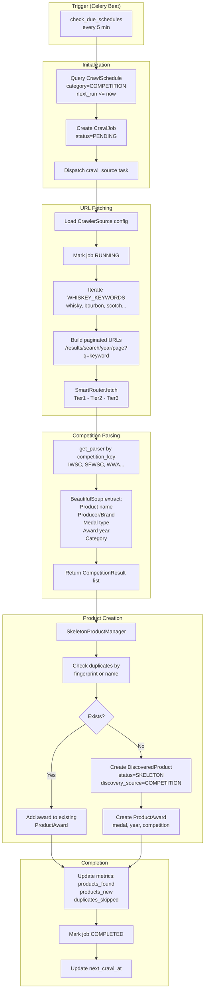
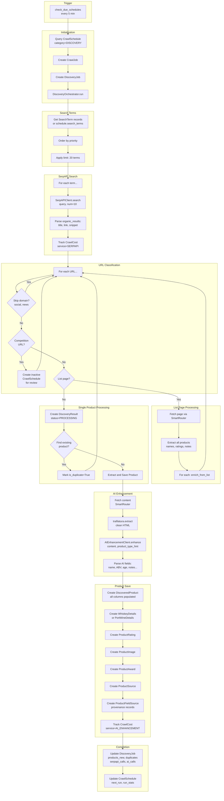

```mermaid
flowchart TB
    subgraph Entry["Entry Points"]
        E1[ContentProcessor.process<br/>from any source]
        E2[trigger_manual_crawl<br/>source_id]
        E3[URL Frontier queue<br/>during enrichment]
    end

    subgraph Fetch["Multi-Tier Fetching"]
        QU[URL queued with<br/>priority and metadata]
        T1[Tier 1: httpx + cookies<br/>Fast, free]
        T1F{Success?}
        T2[Tier 2: Playwright<br/>JS execution]
        T2F{Success?}
        T3[Tier 3: ScrapingBee<br/>Proxy service]
        T3F{Success?}
        FE[Log CrawlError]
        FR[Return FetchResult<br/>content, tier_used]
    end

    subgraph Validate["Response Validation"]
        SC[Check status code<br/>200-299 = success]
        AG{Age gate<br/>detected?}
        AB[Age gate bypass<br/>cookies/click]
    end

    subgraph Clean["Content Cleaning"]
        TF[trafilatura.extract<br/>remove nav, ads]
        NE[Normalize entities]
        CH[Return cleaned HTML]
    end

    subgraph AI["AI Enhancement"]
        AC[AIEnhancementClient.enhance<br/>content, product_type_hint]
        AR[AI returns JSON:<br/>name, brand, category<br/>abv, age, volume<br/>tasting_notes<br/>awards, ratings<br/>images, urls]
    end

    subgraph Populate["Field Population"]
        MP[Map to DiscoveredProduct<br/>individual columns]
        TD{Product type?}
        WD[Create WhiskeyDetails<br/>distillery, region, cask]
        PD[Create PortWineDetails<br/>vintage, style, producer]
        RR[Create ProductRating<br/>score, source, reviewer]
        IR[Create ProductImage<br/>type: bottle/label/tasting]
        AW[Create ProductAward<br/>medal, competition, year]
    end

    subgraph Brand["Brand Management"]
        EB[Extract brand name]
        CB{Brand<br/>exists?}
        NB[Create DiscoveredBrand]
        BS[Create BrandSource]
        BA[Create BrandAward]
    end

    subgraph Provenance["Provenance Tracking"]
        PFS[Create ProductFieldSource<br/>for each field:<br/>field_name<br/>value<br/>confidence<br/>extracted_at]
    end

    subgraph Cost["Cost Tracking"]
        CC[Create CrawlCost<br/>service, operation<br/>cost_cents, url]
    end

    subgraph Dedup["Deduplication"]
        DD{Check exists by:<br/>fingerprint<br/>name+brand<br/>GTIN}
        DM[Mark duplicate<br/>increment metrics]
        SV[Save new product]
    end

    subgraph Result["Result"]
        PSR[ProductSaveResult:<br/>product<br/>created<br/>details_created<br/>awards/ratings/images]
    end

    E1 & E2 & E3 --> QU
    QU --> T1 --> T1F
    T1F -->|No| T2 --> T2F
    T1F -->|Yes| FR
    T2F -->|No| T3 --> T3F
    T2F -->|Yes| FR
    T3F -->|No| FE
    T3F -->|Yes| FR
    FR --> SC --> AG
    AG -->|Yes| AB --> TF
    AG -->|No| TF
    TF --> NE --> CH --> AC --> AR
    AR --> MP --> TD
    TD -->|Whiskey| WD
    TD -->|Port| PD
    WD & PD --> RR --> IR --> AW
    AW --> EB --> CB
    CB -->|No| NB --> BS --> BA
    CB -->|Yes| BS
    BA --> PFS --> CC --> DD
    DD -->|Yes| DM --> PSR
    DD -->|No| SV --> PSR
```

# Spiritswise Web Crawler - Flow Documentation

This document describes the three main crawler flows and the Django models they interact with.

---

## Table of Contents

1. [Award/Competition Discovery Flow](#1-awardcompetition-discovery-flow)
2. [Generic Web Search Discovery Flow](#2-generic-web-search-discovery-flow)
3. [Single Product Search Flow](#3-single-product-search-flow)
4. [Models Summary](#4-models-summary)

---

## 1. Award/Competition Discovery Flow

Discovers products by crawling competition websites (IWSC, SFWSC, WWA, etc.) and extracting award-winning spirits.

### Entry Points

| Type | Location | Function |
|------|----------|----------|
| Celery Beat | `tasks.py` | `check_due_schedules()` every 5 min |
| Celery Task | `tasks.py` | `crawl_source(source_id, job_id)` |
| Manual | `tasks.py` | `trigger_manual_crawl(source_id)` |

### Flow Diagram



### Models Used

| Model | Operation | Purpose |
|-------|-----------|---------|
| `CrawlSchedule` | READ, UPDATE | Load schedule config, update run stats |
| `CrawlJob` | CREATE, UPDATE | Track crawl job status and metrics |
| `CrawlerSource` | READ | Load source configuration |
| `DiscoveredProduct` | CREATE, READ, UPDATE | Create skeleton products, check duplicates |
| `ProductAward` | CREATE | Link products to competition awards |
| `CrawledSource` | CREATE | Store crawled page HTML |
| `CrawlError` | CREATE | Log fetch/parse errors |

### External Services

- **SmartRouter**: Multi-tier content fetching (httpx → Playwright → ScrapingBee)
- **BeautifulSoup**: HTML parsing for competition results

---

## 2. Generic Web Search Discovery Flow

Discovers products by searching Google via SerpAPI and processing the results.

### Entry Points

| Type | Location | Function |
|------|----------|----------|
| Celery Beat | `tasks.py` | `check_due_schedules()` every 5 min |
| Celery Task | `tasks.py` | `run_scheduled_job(schedule_id, job_id)` |
| Orchestrator | `discovery_orchestrator.py` | `DiscoveryOrchestrator.run()` |

### Flow Diagram



### Models Used

| Model | Operation | Purpose |
|-------|-----------|---------|
| `CrawlSchedule` | READ, UPDATE | Load schedule, update run stats |
| `CrawlJob` | CREATE, UPDATE | Track job status |
| `DiscoveryJob` | CREATE, UPDATE | Track discovery-specific metrics |
| `DiscoveryResult` | CREATE, UPDATE | Track each URL processed |
| `SearchTerm` | READ, UPDATE | Load search terms, update usage count |
| `DiscoveredProduct` | CREATE, READ, UPDATE | Create/update products |
| `WhiskeyDetails` | CREATE | Whiskey-specific attributes |
| `PortWineDetails` | CREATE | Port wine-specific attributes |
| `ProductAward` | CREATE | Competition awards found in content |
| `ProductRating` | CREATE | Rating data from reviews |
| `ProductImage` | CREATE | Product images |
| `ProductSource` | CREATE | Link product to crawled source |
| `ProductFieldSource` | CREATE | Field-level provenance tracking |
| `CrawledSource` | CREATE | Store crawled page HTML |
| `CrawlCost` | CREATE | Track API costs (SerpAPI, AI) |
| `CrawlError` | CREATE | Log errors |

### External Services

- **SerpAPI**: Google search (1 call per search term)
- **AI Enhancement Service**: Extract structured data (1 call per page)
- **SmartRouter**: Multi-tier content fetching
- **trafilatura**: HTML content extraction

---

## 3. Single Product Search Flow

Processes individual product URLs to extract detailed product information.

### Entry Points

| Type | Location | Function |
|------|----------|----------|
| Direct | `content_processor.py` | `ContentProcessor.process(url, content, source, job)` |
| Manual | `tasks.py` | `trigger_manual_crawl(source_id)` |
| Queue | URL Frontier | During generic search enrichment |

### Flow Diagram



### Models Used

| Model | Operation | Purpose |
|-------|-----------|---------|
| `DiscoveredProduct` | CREATE, READ, UPDATE | Main product record |
| `CrawledSource` | CREATE | Store crawled page HTML |
| `CrawlJob` | READ, UPDATE | Track metrics |
| `WhiskeyDetails` | CREATE | Whiskey-specific data |
| `PortWineDetails` | CREATE | Port wine-specific data |
| `ProductAward` | CREATE | Competition awards |
| `ProductRating` | CREATE | Rating data |
| `ProductImage` | CREATE | Product images |
| `ProductSource` | CREATE | Link product to source |
| `ProductFieldSource` | CREATE | Field-level provenance |
| `DiscoveredBrand` | CREATE, READ | Brand management |
| `BrandSource` | CREATE | Link brand to source |
| `BrandAward` | CREATE | Brand awards |
| `CrawlCost` | CREATE | Cost tracking |
| `CrawlError` | CREATE | Error logging |

### External Services

- **SmartRouter**: Multi-tier fetching (httpx → Playwright → ScrapingBee)
- **AI Enhancement Service**: Structured data extraction
- **trafilatura**: HTML content cleaning

---

## 4. Models Summary

### Models by Flow

| Model | Competition | Generic Search | Single Product |
|-------|:-----------:|:--------------:|:--------------:|
| `CrawlSchedule` | Yes | Yes | - |
| `CrawlJob` | Yes | Yes | Yes |
| `DiscoveryJob` | - | Yes | - |
| `DiscoveryResult` | - | Yes | - |
| `SearchTerm` | - | Yes | - |
| `CrawlerSource` | Yes | - | - |
| `DiscoveredProduct` | Yes (skeleton) | Yes (full) | Yes (full) |
| `WhiskeyDetails` | - | Yes | Yes |
| `PortWineDetails` | - | Yes | Yes |
| `ProductAward` | Yes | Yes | Yes |
| `ProductRating` | - | Yes | Yes |
| `ProductImage` | - | Yes | Yes |
| `ProductSource` | - | Yes | Yes |
| `ProductFieldSource` | - | Yes | Yes |
| `CrawledSource` | Yes | Yes | Yes |
| `DiscoveredBrand` | - | Yes | Yes |
| `BrandSource` | - | Yes | Yes |
| `BrandAward` | - | Yes | Yes |
| `CrawlCost` | - | Yes | Yes |
| `CrawlError` | Yes | Yes | Yes |

### Database Tables

```
Core Product Tables:
├── discovered_products      # Main product records
├── whiskey_details          # Whiskey-specific attributes
├── port_wine_details        # Port wine-specific attributes
└── product_candidates       # Unprocessed product candidates

Product Relations:
├── product_award            # Competition awards
├── product_rating           # Ratings from various sources
├── product_image            # Product images
├── product_source           # Links products to crawled sources
└── product_field_sources    # Field-level provenance

Brand Tables:
├── discovered_brand         # Brand records
├── brand_source             # Links brands to sources
└── brand_award              # Brand-level awards

Crawl Management:
├── crawl_jobs               # Individual crawl job tracking
├── crawler_sources          # Source configurations (legacy)
├── crawl_schedule           # Unified scheduling
├── crawled_sources          # Stored HTML pages
├── crawled_urls             # URL tracking
└── crawl_errors             # Error logging

Discovery:
├── discovery_job            # Discovery job tracking
├── discovery_result         # Per-URL results
├── discovery_search_term    # Search terms
└── discovery_source_config  # Source configurations

Analytics:
├── crawl_costs              # API cost tracking
├── crawler_metrics          # Performance metrics
├── category_insight         # Category analytics
└── quota_usage              # API quota tracking

Pricing:
├── product_prices           # Current prices
├── price_history            # Historical prices
├── price_alerts             # Price alert rules
└── product_availability     # Stock availability

Commerce:
├── shop_inventory           # Shop inventory data
└── purchase_recommendation  # Purchase recommendations
```

### Entity Relationship Overview

```
CrawlSchedule (unified scheduler)
│
├── DiscoveryJob (discovery flow)
│   ├── SearchTerm
│   └── DiscoveryResult
│       └── DiscoveredProduct
│
├── CrawlJob (crawl/competition flow)
│   ├── CrawlerSource (legacy) OR CrawlSchedule
│   └── DiscoveredProduct
│       │
│       ├── CrawledSource (where found)
│       ├── ProductSource (link to source)
│       ├── ProductFieldSource (provenance)
│       │
│       ├── WhiskeyDetails OR PortWineDetails
│       ├── ProductAward
│       ├── ProductRating
│       ├── ProductImage
│       │
│       └── DiscoveredBrand
│           ├── BrandSource
│           └── BrandAward
│
└── CrawlCost (cost tracking)
```

---

## External Services Summary

| Service | Used By | Purpose | Cost |
|---------|---------|---------|------|
| **SerpAPI** | Generic Search | Google search queries | ~$0.05/search |
| **AI Enhancement** | Generic Search, Single Product | Structured data extraction | Variable |
| **ScrapingBee** | All flows (Tier 3) | Proxy-based fetching | ~$0.003/page |
| **Playwright** | All flows (Tier 2) | JavaScript rendering | Free (self-hosted) |
| **httpx** | All flows (Tier 1) | Fast HTTP requests | Free |
| **trafilatura** | Generic Search, Single Product | HTML content extraction | Free |

---

*Last updated: 2026-01-04*
