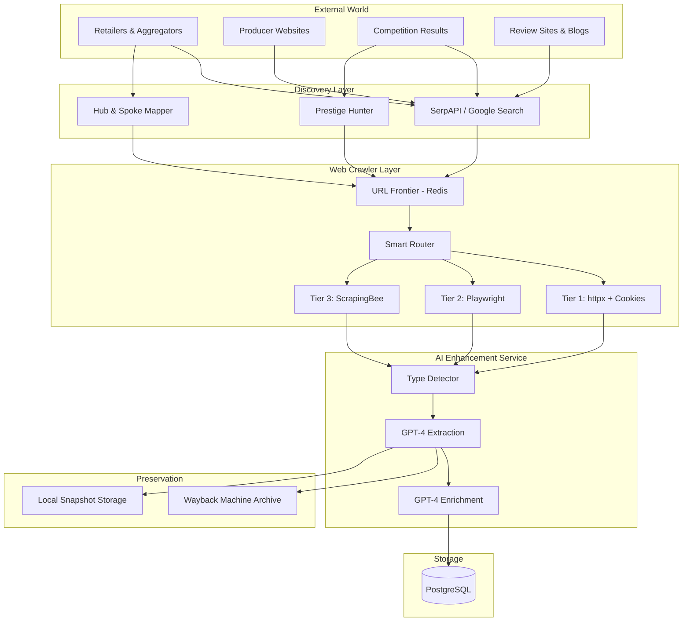

# Web Crawler Architecture Specification v3

> Version: 3.0.0 (Merged Comprehensive)
> Created: 2025-12-27
> Status: Ready for Implementation
> Authors: AI Enhancement Engine Team

## Executive Summary

This document specifies the architecture for a state-of-the-art web crawler system designed to build the world's most comprehensive **whiskey and port wine database**. It addresses industry-specific challenges including age verification gates, anti-bot protections, and content preservation.

### Why Port Wine is a Strategic Priority

While whiskey is well-covered by competitors, **port wine represents an underserved growth market**:
- Port Wine market projected to grow from $1.10B (2025) to $3.20B (2035) at 8.5% CAGR
- Ruby and Tawny ports appeal to younger consumers seeking sweeter profiles
- Premiumization trend: "less but better" mindset aligns with aged Tawnies and Vintage Ports
- Port-based cocktails trending among Gen Z and Millennials
- Fortified wine market growing at 9.4% CAGR through 2030

### Key Architectural Decisions

1. **Hybrid Push-Pull Discovery**: Combines standard crawling with "Prestige-Led" discovery (hunting award winners)
2. **Smart Access Layer**: Multi-tiered fetching (Cookies → Headless → ScrapingBee) for cost-effective age gate handling
3. **Content Resilience**: "Summarize, Archive & Link" strategy with Wayback Machine for link rot mitigation
4. **Data Separation**: Strict separation between Products (facts) and Articles (narrative)
5. **Existing AI Integration**: Uses our AI Enhancement Service (`/api/v1/enhance/from-crawler/`) with GPT-4 for maximum accuracy

---

## 1. Architecture Overview

### 1.1 System Context Diagram



### 1.2 Design Principles

1. **Cookie-First Entry**: Attempt age gate bypass via cookies before resource-intensive headless browsers
2. **Prestige-First Discovery**: Prioritize award-winning bottles as high-value targets
3. **Hub-Spoke Discovery**: Use major retailers (Hubs) to discover Producer sites (Spokes)
4. **Content Separation**: Strictly separate Products (specs) from Articles (reviews/history)
5. **Use Existing Services**: Leverage our AI Enhancement Service, not external extraction tools
6. **Accuracy Over Cost**: Use GPT-4 (not GPT-4o-mini) for product extraction quality

---

## 2. Age Verification & Compliance Strategy

95% of target sites enforce age gates. Standard crawlers fail here.

### 2.1 Level 1: Cookie Injection (70% Success Rate)

Most sites check for specific cookies. We inject these into every request.

```python
AGE_GATE_COOKIES = {
    # Whiskey Sites
    "thewhiskyexchange.com": {"age_verification": "true", "over18": "1"},
    "masterofmalt.com": {"age_check": "passed", "over18": "1"},
    "whiskyadvocate.com": {"age_verified": "true"},
    "whisky.de": {"age_verified": "1", "dob": "1990-01-01"},

    # Port Wine Sites
    "taylor.pt": {"age_gate": "1990-01-01", "legal_age": "true"},
    "grahams-port.com": {"age_verified": "true"},
    "fonseca.pt": {"over18": "1"},
    "symington.com": {"age_check": "passed"},
    "niepoort-vinhos.com": {"age_verified": "true"},

    # Generic fallbacks (try on unknown sites)
    "_default": {
        "age_verified": "true",
        "dob": "1990-01-01",
        "birth_date": "1990-01-01",
        "legal_drinking_age": "1",
        "over18": "1",
        "age_check": "passed"
    }
}
```

### 2.2 Level 2: Semantic Interaction (30% Success Rate)

For sites requiring active clicking (e.g., "Enter Site" buttons):

**Trigger Conditions:**
- Fetched content length < 500 characters
- Content contains keywords: "Legal Drinking Age", "Are you 21", "Age Verification"

**Solver Logic:**
1. Scan DOM for buttons/links
2. Match text against whitelist: "Yes", "Enter", "I am 18+", "I am 21+", "Confirm", "Agree", "Enter Site"
3. Click and wait for navigation
4. **Persist**: Save resulting session cookies to Redis for future requests to this domain

### 2.3 Legal/Ethical Considerations

**Our Position**: We are simulating what a legitimate adult user would do manually. We do not:
- Circumvent paywalls or subscription gates
- Access content not available to the public
- Violate robots.txt directives
- Overload servers with excessive requests

**Mitigation**: Each CrawlerSource has `tos_compliant` and `robots_txt_compliant` flags reviewed before activation.

---

## 3. Technology Stack

### 3.1 Fetching Engines (Smart Router Tiers)

| Tier | Technology | Use Case | Cost |
|------|------------|----------|------|
| **1 (Base)** | httpx + HTTP/2 | Static sites, blogs, open APIs | Free |
| **2 (Headless)** | Playwright | JS-rendered sites, complex age gates | Server CPU |
| **3 (Premium)** | ScrapingBee | Cloudflare, Akamai, IP bans | $49/mo |

**Decision**: Start with Tier 1, escalate on failure. Mark domains that require Tier 3 to skip lower tiers on subsequent requests.

### 3.2 3rd-Party Services

| Service | Purpose | Cost | Decision |
|---------|---------|------|----------|
| **SerpAPI** | Google Search API for discovery | $75/mo | Essential |
| **ScrapingBee** | Hard scraping (proxies, CAPTCHA) | $49/mo | Use for blocked sites |
| **Wayback Machine** | Public archiving of articles | Free | Use for link rot |
| **OpenAI GPT-4** | Extraction & enrichment | ~$100/mo | Use existing AI Enhancement Service |

**Total Estimated**: ~$224/mo (excluding hosting)

### 3.3 Python Libraries

```python
# requirements.txt additions
httpx[http2]==0.27.0          # Async HTTP client
playwright==1.40.0            # Headless browser
beautifulsoup4==4.12.3        # HTML parsing
lxml==5.1.0                   # Fast parser backend
scrapingbee==1.1.2            # Tier 3 fetching
waybackpy==3.0.6              # Archiving interface
tenacity==8.2.3               # Retry logic with backoff
robotsparser==0.0.6           # robots.txt parsing
aioredis==2.0.1               # Async Redis for URL queue
fuzzywuzzy==0.18.0            # Fuzzy string matching (deduplication)
python-Levenshtein==0.25.0    # Fast Levenshtein distance
trafilatura==1.6.3            # Web content extraction
```

**Note**: We do NOT use langchain. Extraction uses our existing AI Enhancement Service.

---

## 4. Source Discovery Methods

### 4.1 Method A: Hub & Spoke (Retailer-Driven)

Crawl "Hubs" (large retailers/aggregators) to discover "Spokes" (producers).

**Whiskey Hubs:**
- thewhiskyexchange.com/brands
- masterofmalt.com/brands
- whiskybase.com/distilleries

**Port Wine Hubs:**
- wine-searcher.com (fortified wine section)
- vivino.com (port category)
- wine.com/port

**Workflow:**
1. Crawl Hub brand/producer lists
2. Extract brand names and external links
3. If no link: Query SerpAPI: `"{Brand Name} official site"`
4. Validate domain and add to CrawlerSource

### 4.2 Method B: Prestige-Led Discovery (Competition-Driven)

Award-winning bottles are high-signal, high-demand targets.

**Workflow:**
1. Ingest competition results (last 5 years)
2. Extract winner bottle names
3. Check database: exists → tag with award; missing → create "Skeleton Product"
4. For each Skeleton Product, trigger 3 SerpAPI searches:
   - `"{Product Name} price buy online"` → Finds retailers
   - `"{Product Name} review tasting notes"` → Finds articles
   - `"{Product Name} official site"` → Finds producer
5. Queue top results with Priority = 10 (highest)

---

## 5. Competition Data Sources

### 5.1 Whiskey Competitions

| Competition | Results URL | Format | Frequency | Notes |
|-------------|-------------|--------|-----------|-------|
| **IWSC** | `iwsc.net/results/search/{year}` | HTML searchable DB | Annual (results throughout year) | Searchable since 2013 |
| **SFWSC** | `thetastingalliance.com/results/` | Email-gated, then HTML | Annual (May) | Requires email signup |
| **World Whiskies Awards** | `worldwhiskiesawards.com/winners` | HTML list | Annual (Spring) | Clear category structure |
| **Icons of Whisky** | `worlddrinksawards.com/news/` | HTML articles | Annual | Part of WWA |

### 5.2 Port Wine & Fortified Competitions

| Competition | Results URL | Format | Frequency | Notes |
|-------------|-------------|--------|-----------|-------|
| **Decanter WWA** | `awards.decanter.com` | Searchable DB | Annual (June) | Filter by "Port" type |
| **IWC** | `internationalwinechallenge.com/trophy-results-{year}.html` | HTML | Annual (July) | Champion Fortified category |
| **Wine Spectator Top 100** | `winespectator.com/toplists` | HTML list | Annual (Nov) | May include ports |
| **IWSC (Wine)** | `iwsc.net/results/search/{year}` | HTML searchable DB | Annual | Filter by fortified wine |

### 5.3 Competition Parsing Strategy

```python
COMPETITION_CONFIGS = {
    "iwsc": {
        "base_url": "https://www.iwsc.net/results/search/{year}",
        "years": range(2019, 2026),
        "categories": ["Whisky", "Port", "Fortified Wine"],
        "selectors": {
            "product_name": ".result-item .name",
            "medal": ".result-item .medal-type",
            "producer": ".result-item .producer"
        }
    },
    "world_whiskies_awards": {
        "base_url": "https://www.worldwhiskiesawards.com/winners",
        "format": "single_page",
        "selectors": {
            "category": ".category-header",
            "winner": ".winner-item .name"
        }
    },
    "decanter_wwa": {
        "base_url": "https://awards.decanter.com",
        "search_params": {"wine_type": "Port", "medal": "Platinum,Gold"},
        "format": "searchable_db"
    }
}
```

---

## 6. Whiskey Sources (Detailed)

### 6.1 Review & Retailer Sites

| Source | URL | Category | Age Gate | JS Required | Notes |
|--------|-----|----------|----------|-------------|-------|
| The Whisky Exchange | thewhiskyexchange.com | Retailer | Cookie | No | Product pages via sitemap |
| Master of Malt | masterofmalt.com | Retailer | Click | Some | May need Tier 2/3 |
| Whisky Advocate | whiskyadvocate.com | Review | Cookie | No | Blocks AI bots, standard OK |
| Whiskybase | whiskybase.com | Database | None | No | May block (403), try proxy |
| Distiller | distiller.com | Review | None | No | Permissive, good source |
| Scotchwhisky.com | scotchwhisky.com | News | None | No | Permissive |

### 6.2 DACH Retailers (Pricing Intelligence)

| Source | URL | Country | Notes |
|--------|-----|---------|-------|
| Whisky.de | whisky.de | Germany | Large catalog, permissive |
| Weinquelle | weinquelle.com | Germany | Wine and spirits |
| Whisky.ch | whisky.ch | Switzerland | Swiss pricing |
| Weisshaus | weisshaus.de | Germany | Good selection |

### 6.3 Producer Sites (Sample)

| Producer | URL | Region | Notes |
|----------|-----|--------|-------|
| Glenfiddich | glenfiddich.com | Speyside | Official, age gate |
| Macallan | themacallan.com | Speyside | Official, age gate |
| Ardbeg | ardbeg.com | Islay | Official |
| Lagavulin | malts.com/lagavulin | Islay | Diageo umbrella |
| Buffalo Trace | buffalotracedistillery.com | Kentucky | Bourbon |

---

## 7. Port Wine Sources (Detailed)

### 7.1 Major Port Houses

**Symington Family Estates** (owns ~30% of Douro vineyards):
| Brand | URL | Founded | Style Focus |
|-------|-----|---------|-------------|
| Graham's | grahams-port.com | 1820 | Vintage, aged Tawny |
| Dow's | dows-port.com | 1798 | Vintage, dry style |
| Warre's | warres.com | 1670 | Oldest British house |
| Cockburn's | cockburns.com | 1815 | Special Reserve |
| Quinta do Vesuvio | quintadovesuvio.com | 1827 | Single Quinta Vintage |

**The Fladgate Partnership** (Taylor's Group):
| Brand | URL | Founded | Style Focus |
|-------|-----|---------|-------------|
| Taylor's | taylor.pt | 1692 | Never sold, premium |
| Fonseca | fonseca.pt | 1815 | Rich, robust style |
| Croft | croftport.com | 1588 | Oldest house |

**Independent Producers:**
| Brand | URL | Founded | Style Focus |
|-------|-----|---------|-------------|
| Niepoort | niepoort-vinhos.com | 1842 | Innovative, natural |
| Quinta do Noval | quintadonoval.com | 1813 | Nacional (ungrafted) |
| Ramos Pinto | ramospinto.pt | 1880 | Art deco branding |
| Sandeman | sandeman.com | 1790 | The Don icon |
| Ferreira | sfreirawines.com | 1751 | Dona Antónia heritage |
| Kopke | sogevinus.com/kopke | 1638 | Oldest port house |
| Burmester | burmester.pt | ~1750 | Family owned |
| Calem | calem.pt | 1859 | Tourism focused |

### 7.2 Review Sites for Port

| Source | URL | Notes |
|--------|-----|-------|
| Wine Spectator | winespectator.com | Subscription for full reviews |
| Decanter | decanter.com | Good port coverage |
| JancisRobinson | jancisrobinson.com | Expert reviews (subscription) |
| Robert Parker | robertparker.com | Wine Advocate ratings |
| Cellar Tracker | cellartracker.com | Community reviews |
| Wine Enthusiast | winemag.com | Ratings database |

### 7.3 DACH Wine Retailers (Port)

| Source | URL | Country | Notes |
|--------|-----|---------|-------|
| Jacques Wein-Depot | jacques.de | Germany | Chain, good port selection |
| Wein & Co | weinco.at | Austria | Online + stores |
| vinexus.de | vinexus.de | Germany | Online retailer |
| gute-weine.de | gute-weine.de | Germany | Specialist |

### 7.4 Regulatory / Industry

| Source | URL | Notes |
|--------|-----|-------|
| IVDP | ivdp.pt | Instituto dos Vinhos do Douro e Porto - Official |
| Douro Boys | douroboys.com | Premium producer consortium |

---

## 8. Database Models

### 8.1 CrawlerSource Model

```python
class CrawlerSource(models.Model):
    """Configuration for a crawlable content source."""

    # Identity
    id = models.UUIDField(primary_key=True, default=uuid.uuid4)
    name = models.CharField(max_length=100, unique=True)
    slug = models.SlugField(max_length=100, unique=True)
    base_url = models.URLField()

    # Classification
    product_types = models.JSONField(default=list)  # ['whiskey', 'port_wine']
    category = models.CharField(max_length=20, choices=[
        ('retailer', 'Retailer'),
        ('producer', 'Producer'),
        ('review', 'Review Site'),
        ('competition', 'Competition'),
        ('news', 'News/Blog'),
        ('database', 'Product Database'),
    ])

    # Crawl Configuration
    is_active = models.BooleanField(default=True)
    priority = models.IntegerField(default=5)  # 1-10
    crawl_frequency_hours = models.IntegerField(default=24)
    rate_limit_rpm = models.IntegerField(default=10)

    # Age Gate Configuration
    age_gate_type = models.CharField(max_length=20, choices=[
        ('none', 'None'),
        ('cookie', 'Cookie Injection'),
        ('click', 'Click Required'),
        ('form', 'Form Submission'),
    ], default='none')
    age_gate_cookies = models.JSONField(default=dict, blank=True)

    # Technical Requirements
    requires_javascript = models.BooleanField(default=False)
    requires_tier3 = models.BooleanField(default=False)  # Needs ScrapingBee
    custom_headers = models.JSONField(default=dict, blank=True)

    # Discovery
    discovery_method = models.CharField(max_length=20, choices=[
        ('hub', 'Hub & Spoke'),
        ('search', 'SerpAPI Search'),
        ('competition', 'Competition Results'),
        ('manual', 'Manual Entry'),
    ], default='manual')

    # Compliance
    robots_txt_compliant = models.BooleanField(default=True)
    tos_compliant = models.BooleanField(default=True)
    compliance_notes = models.TextField(blank=True)

    # Status
    last_crawl_at = models.DateTimeField(null=True, blank=True)
    next_crawl_at = models.DateTimeField(null=True, blank=True)
    last_crawl_status = models.CharField(max_length=20, blank=True)
    total_products_found = models.IntegerField(default=0)

    created_at = models.DateTimeField(auto_now_add=True)
    updated_at = models.DateTimeField(auto_now=True)
```

### 8.2 CrawlerKeyword Model

```python
class CrawlerKeyword(models.Model):
    """Keywords for product discovery searches."""

    id = models.UUIDField(primary_key=True, default=uuid.uuid4)
    keyword = models.CharField(max_length=200)

    product_types = models.JSONField(default=list)  # ['whiskey'] or ['port_wine']
    search_context = models.CharField(max_length=20, choices=[
        ('general', 'General Discovery'),
        ('new_release', 'New Release'),
        ('review', 'Review'),
        ('competition', 'Competition/Award'),
        ('pricing', 'Pricing Intelligence'),
    ])

    is_active = models.BooleanField(default=True)
    priority = models.IntegerField(default=5)
    search_frequency_hours = models.IntegerField(default=168)  # Weekly

    last_searched_at = models.DateTimeField(null=True, blank=True)
    total_results_found = models.IntegerField(default=0)
```

### 8.3 Article Model (for Reviews/Content)

```python
class CrawledArticle(models.Model):
    """Editorial content with preservation strategy."""

    id = models.UUIDField(primary_key=True, default=uuid.uuid4)
    source = models.ForeignKey(CrawlerSource, on_delete=models.SET_NULL, null=True)

    # Original Content
    original_url = models.URLField(max_length=2000, unique=True)
    title = models.CharField(max_length=500)
    author = models.CharField(max_length=200, blank=True)
    published_date = models.DateField(null=True, blank=True)

    # AI-Generated Summary (Public Safe)
    summary_bullets = models.JSONField(default=list)  # ["Point 1", "Point 2"]
    extracted_tags = models.JSONField(default=list)   # ["smoky", "peated", "aged"]
    sentiment_score = models.FloatField(null=True)    # -1.0 to 1.0

    # Product References (Many-to-Many)
    products = models.ManyToManyField(
        'DiscoveredProduct',
        through='ArticleProductMention',
        related_name='articles'
    )

    # Preservation
    local_snapshot_path = models.CharField(max_length=500, blank=True)
    wayback_url = models.URLField(max_length=2000, blank=True)
    is_original_live = models.BooleanField(default=True)
    last_health_check = models.DateTimeField(null=True, blank=True)

    discovered_at = models.DateTimeField(auto_now_add=True)
```

### 8.4 Article-Product Junction (Many-to-Many)

```python
class ArticleProductMention(models.Model):
    """Links articles to products they mention."""

    article = models.ForeignKey(CrawledArticle, on_delete=models.CASCADE)
    product = models.ForeignKey('DiscoveredProduct', on_delete=models.CASCADE)

    # Context
    mention_type = models.CharField(max_length=20, choices=[
        ('review', 'Full Review'),
        ('comparison', 'Comparison/List'),
        ('mention', 'Brief Mention'),
        ('award', 'Award Announcement'),
    ])

    # Extracted from article
    rating_score = models.FloatField(null=True)       # If review has score
    rating_scale = models.CharField(max_length=20, blank=True)  # "100", "5 stars"
    excerpt = models.TextField(blank=True)            # Relevant quote

    class Meta:
        unique_together = ['article', 'product']
```

### 8.5 DiscoveredProduct Model

```python
class DiscoveredProduct(models.Model):
    """Products discovered by crawler, pending review."""

    id = models.UUIDField(primary_key=True, default=uuid.uuid4)

    # Source
    source = models.ForeignKey(CrawlerSource, on_delete=models.SET_NULL, null=True)
    source_url = models.URLField(max_length=2000)

    # Identification
    fingerprint = models.CharField(max_length=64, db_index=True)
    product_type = models.CharField(max_length=20)  # 'whiskey' or 'port_wine'

    # Raw & Extracted Data
    raw_content = models.TextField()
    raw_content_hash = models.CharField(max_length=64)
    extracted_data = models.JSONField(default=dict)
    enriched_data = models.JSONField(default=dict)
    extraction_confidence = models.FloatField(null=True)

    # Awards (from Prestige Discovery)
    awards = models.JSONField(default=list)  # [{"competition": "IWSC", "year": 2024, "medal": "Gold"}]

    # Status
    status = models.CharField(max_length=20, choices=[
        ('skeleton', 'Skeleton (needs enrichment)'),
        ('pending', 'Pending Review'),
        ('approved', 'Approved'),
        ('rejected', 'Rejected'),
        ('duplicate', 'Duplicate'),
    ], default='pending')

    # Matching
    matched_product_id = models.UUIDField(null=True, blank=True)
    match_confidence = models.FloatField(null=True)

    discovered_at = models.DateTimeField(auto_now_add=True)
    reviewed_at = models.DateTimeField(null=True, blank=True)
```

---

## 9. Keywords by Product Type

### 9.1 Whiskey Keywords (32)

| Context | Keywords |
|---------|----------|
| **General** | single malt, blended malt, blended scotch, grain whisky, bourbon, tennessee whiskey, rye whiskey, irish whiskey, japanese whisky, canadian whisky |
| **Style** | cask strength, single cask, cask finish, peated, heavily peated, sherry cask, port cask, rum cask |
| **Age** | 10 year, 12 year, 15 year, 18 year, 21 year, 25 year, 30 year, NAS, no age statement |
| **New Release** | new release, limited edition, special release, distillery exclusive |
| **Region** | Speyside, Islay, Highland, Lowland, Campbeltown, Kentucky, Tennessee |
| **Competition** | gold medal, whisky of the year, best in class, award winning |
| **Pricing (DACH)** | whisky preis, whisky kaufen, single malt preis |

### 9.2 Port Wine Keywords (35)

| Context | Keywords |
|---------|----------|
| **Style** | vintage port, tawny port, ruby port, LBV, late bottled vintage, colheita, crusted port, white port, rosé port |
| **Age** | 10 year tawny, 20 year tawny, 30 year tawny, 40 year tawny, very old tawny |
| **Vintage** | declared vintage, vintage declaration, 2022 vintage, 2021 vintage, 2017 vintage, 2016 vintage, 2011 vintage, 2007 vintage, 2003 vintage, 2000 vintage |
| **Producer** | Taylor's port, Graham's port, Fonseca port, Dow's port, Warre's port, Niepoort, Quinta do Noval, Nacional |
| **New Release** | new vintage declaration, port release, harvest report |
| **Competition** | gold medal port, best port, 95+ points, vintage of the year |
| **Pricing (DACH)** | portwein preis, portwein kaufen, tawny port preis |

---

## 10. Pipeline Architecture

### 10.1 Smart Router Flow

```python
async def fetch_content(url: str, source: CrawlerSource) -> Tuple[str, int]:
    """Fetch content using appropriate tier."""

    # Check if domain requires Tier 3
    if source.requires_tier3:
        return await tier3_scrapingbee(url)

    # Tier 1: httpx with cookies
    cookies = source.age_gate_cookies or AGE_GATE_COOKIES.get("_default", {})
    try:
        content, status = await tier1_httpx(url, cookies)
        if is_valid_content(content):
            return content, status
    except (Blocked, AgeGateDetected):
        pass

    # Tier 2: Playwright with click solver
    if source.age_gate_type in ['click', 'form'] or source.requires_javascript:
        try:
            content, status, new_cookies = await tier2_playwright(url)
            if new_cookies:
                await cache_cookies(source.base_url, new_cookies)
            if is_valid_content(content):
                return content, status
        except (Timeout, Blocked):
            pass

    # Tier 3: ScrapingBee
    content, status = await tier3_scrapingbee(url)
    if status == 200:
        source.requires_tier3 = True  # Mark for next time
        await source.asave(update_fields=['requires_tier3'])

    return content, status
```

### 10.2 AI Enhancement Integration

```python
async def process_crawled_content(
    content: str,
    source_url: str,
    product_type_hint: str
) -> dict:
    """Send to AI Enhancement Service."""

    async with httpx.AsyncClient(timeout=60.0) as client:
        response = await client.post(
            "http://localhost:8000/api/v1/enhance/from-crawler/",
            json={
                "content": content,
                "source_url": source_url,
                "product_type_hint": product_type_hint
            },
            headers={"Authorization": f"Bearer {settings.API_TOKEN}"}
        )
        return response.json()
```

### 10.3 Link Rot Mitigation Pipeline

```python
async def preserve_article(article: CrawledArticle):
    """Archive article for resilience."""

    # 1. Save local snapshot
    snapshot_path = f"snapshots/{article.id}.html"
    await save_to_local_storage(article.raw_content, snapshot_path)
    article.local_snapshot_path = snapshot_path

    # 2. Submit to Wayback Machine (async, best-effort)
    try:
        wayback = waybackpy.Url(article.original_url)
        archive = await asyncio.to_thread(wayback.save)
        article.wayback_url = archive.archive_url
    except Exception as e:
        logger.warning(f"Wayback save failed for {article.original_url}: {e}")

    await article.asave()


async def check_article_health(article: CrawledArticle):
    """Weekly health check for link rot."""

    async with httpx.AsyncClient() as client:
        try:
            response = await client.head(article.original_url, timeout=10)
            article.is_original_live = response.status_code < 400
        except:
            article.is_original_live = False

    article.last_health_check = timezone.now()
    await article.asave()
```

---

## 11. Cost Analysis

### 11.1 Monthly Operating Costs

| Item | Cost | Notes |
|------|------|-------|
| SerpAPI | $75/mo | 5,000 searches for discovery |
| ScrapingBee | $49/mo | 100k requests for hard sites |
| OpenAI GPT-4 | ~$100/mo | Via AI Enhancement Service |
| Hetzner VPS | $0 | Already provisioned |
| Local Storage | $0 | Use VPS disk for snapshots |
| **Total** | **~$224/mo** | |

### 11.2 Cost per Product

| Component | Cost/Product |
|-----------|--------------|
| SerpAPI Discovery | $0.015 |
| Fetching (avg) | ~$0.001 |
| AI Extraction (GPT-4) | $0.08 |
| **Total** | **~$0.10** |

### 11.3 ROI

- Manual data entry: $2-5 per product
- Crawler cost: $0.10 per product
- **Savings: 95-98%**

---

## 12. Implementation Roadmap

### Phase 1: Foundation (Current)
- [x] AI Enhancement Service complete
- [x] API Endpoints complete
- [ ] Add crawler Django models
- [ ] Implement Age Gate Middleware
- [ ] Create Django Admin for sources/keywords
- [ ] Load fixtures from research

### Phase 2: Core Crawler
- [ ] Implement URL Frontier (Redis)
- [ ] Implement Smart Router (Tier 1/2/3)
- [ ] Integrate SerpAPI client
- [ ] Implement robots.txt compliance
- [ ] Connect to AI Enhancement Service

### Phase 3: Prestige Discovery
- [ ] Crawl competition results (IWSC, SFWSC, WWA, Decanter)
- [ ] Implement "Skeleton Product" creation
- [ ] Build Hunter loop (3x searches per skeleton)
- [ ] Seed database with award winners

### Phase 4: Content & Archiving
- [ ] Implement CrawledArticle model
- [ ] Integrate Wayback Machine
- [ ] Build Article-Product linking
- [ ] Implement link health monitoring

### Phase 5: Production Ready
- [ ] Celery Beat scheduling
- [ ] Monitoring & alerting (Sentry)
- [ ] Load testing
- [ ] Documentation

---

## Appendix A: Open Questions (Resolved)

| Question | Decision |
|----------|----------|
| Use langchain? | **No** - Use existing AI Enhancement Service |
| GPT-4 or GPT-4o-mini? | **GPT-4** - Accuracy is priority |
| Defer proxy service? | **No** - Use ScrapingBee from start |
| S3 for storage? | **Defer** - Use local storage, decide later |
| Article-Product relationship? | **Many-to-Many** via junction table |

---

## Document History

| Version | Date | Changes |
|---------|------|---------|
| 1.0.0 | 2025-12-27 | Original spec (v1) |
| 2.3.0 | 2025-12-27 | User v2 with age gates, prestige discovery |
| 3.0.0 | 2025-12-27 | Merged v3: combined best of v1 + v2 + research |

---

## Sources

- [IWSC Results Database](https://www.iwsc.net/results/search)
- [SFWSC Results via Tasting Alliance](https://thetastingalliance.com/results/)
- [World Whiskies Awards Winners](https://www.worldwhiskiesawards.com/winners)
- [Decanter World Wine Awards Search](https://awards.decanter.com/)
- [IWC Trophy Results](https://www.internationalwinechallenge.com/trophy-results-2024.html)
- [Port Wine Market Report - Future Market Insights](https://www.futuremarketinsights.com/reports/port-wine-market)
- [Fortified Wine Market - Grand View Research](https://www.grandviewresearch.com/industry-analysis/fortified-wine-market-report)
- [Symington Family Estates](https://www.symington.com/)
- [Major Port Producers Guide](https://drinkstype.com/top-port-wine-producers-a-guide-to-the-best-brands-and-wineries/)
